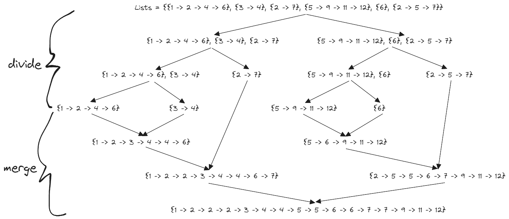

# [23. Merge k Sorted Lists](https://leetcode.com/problems/merge-k-sorted-lists/)

## Intuition
Merge Sort 아이디어를 사용한다.
- 병합할 범위를 반으로 나눈다. 
- 나뉜 두 범위를 재귀적으로 함수를 호출해 병합한다.
- 두 범위를 병합한 결과인 두 리스트를 병합하고 반환한다.

위 설명을 아래 그림으로 표현할 수 있다.


## Implementation
```java
/**
 * Definition for singly-linked list.
 * public class ListNode {
 *     int val;
 *     ListNode next;
 *     ListNode() {}
 *     ListNode(int val) { this.val = val; }
 *     ListNode(int val, ListNode next) { this.val = val; this.next = next; }
 * }
 */
class Solution {
    public ListNode mergeKLists(ListNode[] lists) {
        int n = lists.length;

        if (n == 0) {
            return null;
        }

        return divideAndMerge(0, n - 1, lists);
    }

    private ListNode divideAndMerge(int left, int right, ListNode[] lists) {
        if (left == right) {
            return lists[left];
        }

        int mid = (left + right) / 2;

        return mergeTwoLists(divideAndMerge(left, mid, lists), divideAndMerge(mid + 1, right, lists));
    }

    private ListNode mergeTwoLists(ListNode l1, ListNode l2) {
        ListNode dummy = new ListNode();
        ListNode prev = dummy;

        while (l1 != null && l2 != null) {
            if (l1.val <= l2.val) {
                prev.next = l1;
                l1 = l1.next;
            } else {
                prev.next = l2;
                l2 = l2.next;
            }
            prev = prev.next;
        }

        if (l1 != null) {
            prev.next = l1;
        } else {
            prev.next = l2;
        }

        return dummy.next;
    }
}
```

## Complexity
`n`은 `lists`의 길이, `m`은 전체 노드 개수
- Time complexity: O(mlogn)
- Space complexity: O(logn)
