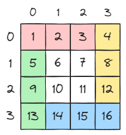
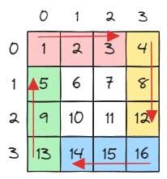

# [48. Rotate Image](https://leetcode.com/problems/rotate-image/)

## Intuition
\
위 그림처럼 레이어를 4 부분으로 나눌 수 있다.\
\
나눈 4부분을 시계 방향으로 돌릴 때, 배열의 인덱스 중 하나는 레이어의 시작 또는 끝에 고정되고, 다른 하나는 증가하거나 감소한다.
이를 이용해 인풋에 비례한 추가 저장 공간 없이 레이어를 좁혀가면서 배열을 회전시킬 수 있다.


## Algorithm
1. 변수를 초기화한다.
   - `int length` : `matrix`의 길이
   - `int layerStart` : 레이어의 시작
   - `int layerEnd` : 레이어의 끝
2. `matrix`의 레이어의 밖에서부터 안까지 회전 작업을 한다.
   1. 4부분으로 나뉜 레이어를 순차적으로 교환한다.
   2. 안쪽 레이어로 이동한다.

## Implementation
```java
class Solution {
   public void rotate(int[][] matrix) {
      int length = matrix.length;

      int layerStart = 0;
      int layerEnd = length - 1;

      while (layerStart < layerEnd) {
         for (int i = layerStart, j = layerEnd; i < layerEnd; i++, j--) {
            int tmp = matrix[layerStart][i];
            matrix[layerStart][i] = matrix[j][layerStart];
            matrix[j][layerStart] = matrix[layerEnd][j];
            matrix[layerEnd][j] = matrix[i][layerEnd];
            matrix[i][layerEnd] = tmp;
         }

         layerStart++;
         layerEnd--;
      }
   }
}
```

## Complexity
`n`은 `matrix`의 길이
- Time complexity: O(n^2)
- Space complexity: O(1)
