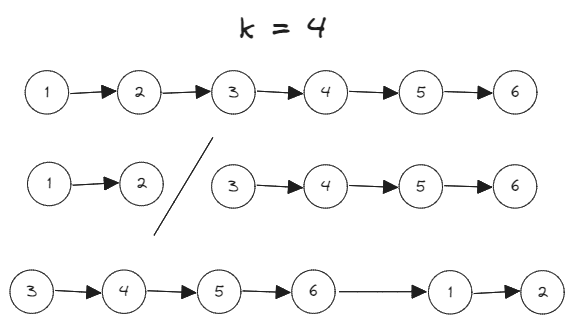

# [61. Rotate List](https://leetcode.com/problems/rotate-list/)

## Intuition
리스트의 길이가 `n`일 때, 길이가 `n - k`, `k` 리스트 두 개로 나눈다. 그리고 리스트의 위치를 변경해서 이어주면 `k`번 오른쪽으로 회전한 리스트가 된다.\


## Algorithm
1. `length`에 리스트의 길이를 저장한다.
2. `k` 값을 조정하고 `0`이라면 회전할 필요가 없으니 `head`를 반환한다.
3. `leftTail`, `rightTail`의 위치를 `head`로 초기화한다.
4. 왼쪽 리스트의 마지막 노드와 오른쪽 리스트의 마지막 노드의 거리는 `k`이다. `rightTail`을 먼저 `k`번 이동한다.
5. `rightTail`이 리스트의 마지막 노드가 될 때까지 `leftTail`과 `rightTail`을 같이 이동한다.
6. `rightTail`과 `head`를 연결한다.
6. `leftTail`의 다음 노드는 회전한 리스트의 헤드가 된다. `newHead`에 `leftTail`의 다음 노드를 할당하고 `leftTail`과 연결을 끊는다.
7. `newHead`를 반환한다.

## Implementation
```java
/**
 * Definition for singly-linked list.
 * public class ListNode {
 *     int val;
 *     ListNode next;
 *     ListNode() {}
 *     ListNode(int val) { this.val = val; }
 *     ListNode(int val, ListNode next) { this.val = val; this.next = next; }
 * }
 */
class Solution {
    public ListNode rotateRight(ListNode head, int k) {
        if (head == null) {
            return null;
        }

        int length = getLength(head);

        k %= length;

        if (k == 0) {
            return head;
        }

        ListNode leftTail = head;
        ListNode rightTail = head;

        for (int i = 0; i < k; i++) {
            rightTail = rightTail.next;
        }

        while (rightTail.next != null) {
            leftTail = leftTail.next;
            rightTail = rightTail.next;
        }

        rightTail.next = head;
        ListNode newHead = leftTail.next;
        leftTail.next = null;

        return newHead;
    }

    private int getLength(ListNode head) {
        int length = 0;

        while (head != null) {
            head = head.next;
            length++;
        }

        return length;
    }
}
```

## Complexity
`n`은 리스트의 길이
- Time complexity: O(n)
- Space complexity: O(1)
