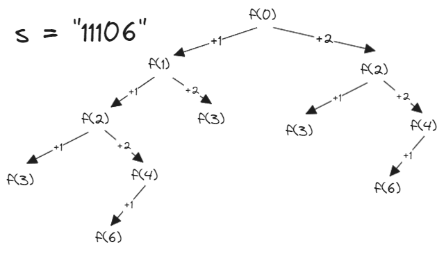

# [91. Decode Ways](https://leetcode.com/problems/decode-ways/)

## Intuition
아래 그림처럼, 현재 위치한 인덱스에서 한 자리 수를 디코딩하는 경우와 두 자리 수를 디코딩하는 경우가 있다.\
\
다이나믹 프로그래밍 기법으로 한 번 해결한 문제의 결과를 재사용하여 시간 복잡도를 줄일 수 있다.

## Algorithm
- `numDecodings` 메소드 : 문자열 `s`를 디코딩할 수 있는 경우의 수를 반환한다.
  1. `int[] cache` : 인덱스 `i`에서의 디코딩 경우의 수를 저장한다. `-1`로 초기화한다.
  2. 인덱스 `0`에서 디코딩 경우의 수를 재귀 함수 `countDecodeWays`를 호출하여 반환한다.
- `countDecodeWays` 메소드 : 재귀적으로 디코딩할 수 있는 경우의 수를 계산한다.
  1. `idx == s.length()`일 경우, 디코딩을 완료했으니 `1`을 반환한다.
  2. `s.charAt(idx) == '0'`일 경우, 유효하지 않는 코드이기 때문에 `0`을 반환한다.
  3. `cache[idx] != -1`일 경우, 이미 계산한 문제이므로 `cache[idx]`를 반환한다.
  4. `result`에 현재 인덱스에서 가능한 디코딩 경우의 수를 저장한다.
     - 한 자리 수를 디코딩 하는 경우 `idx + 1`로 다음 재귀 함수를 호출한다.
     - 두 자리 수를 디코딩 하는 경우 유효한 숫자인지 확인한 뒤 `idx + 2`로 다음 재귀 함수를 호출한다.
  5. `cache[idx]`에 `result`를 저장하고 반환한다.

## Implementation
```java
class Solution {
    public int numDecodings(String s) {
        int n = s.length();

        int[] cache = new int[n];
        Arrays.fill(cache, -1);

        return countDecodeWays(0, s, cache);
    }

    private int countDecodeWays(int idx, String s, int[] cache) {
        if (idx == s.length()) {
            return 1;
        }

        if (s.charAt(idx) == '0') {
            return 0;
        }

        if (cache[idx] != -1) {
            return cache[idx];
        }

        int result = countDecodeWays(idx + 1, s, cache);

        if (idx + 1 < s.length() && Integer.parseInt(s.substring(idx, idx + 2)) <= 26) {
            result += countDecodeWays(idx + 2, s, cache);
        }

        return cache[idx] = result;
    }
}
```

## Complexity 
`n`은 문자열 `s`의 길이
- Time complexity: O(n)
- Space complexity: O(n)
