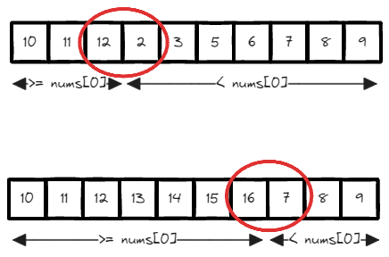

# [153. Find Minimum in Rotated Sorted Array](https://leetcode.com/problems/find-minimum-in-rotated-sorted-array/)

## Intuition
`O(logn)`의 시간 복잡도로 문제를 해결하기 위해 Binary Search 기법을 사용한다.\
\
\
위 그림과 같이 정렬된 배열이 `k`번 회전했을 경우, `k`개의 큰 값이 배열의 앞으로 이동한다.\
배열의 첫 번째 값은 회전된 부분에서 가장 작은 값이고 회전된 부분의 값들은 배열의 첫 번째 값보다 크거나 같다.\
나머지 회전되지 않은 부분은 배열의 첫 번째 값보다 작기 때문에 Binary Search를 적용할 수 있다.

## Algorithm
1. `lo`에 배열의 시작, `hi`에 배열의 끝 인덱스를 할당한다
2. `nums[lo] <= nums[hi]`일 경우 배열이 회전됮 않았으니 배열의 첫 번째 값을 반환한다.
3. `lo <= hi`라면 아래를 반복한다.
   1. `mid`에 `lo`와 `hi`의 중간 값을 할당한다
   2. `nums[mid] >= nums[0]`라면 `mid`는 배열의 회전된 부분에 있다. 오른쪽으로 탐색하기 위해 `lo`를 `mid + 1`로 변경한다.
   3. 아니라면 `mid`는 회전되지 않은 부분에 있으니 왼쪽에서 탐색하기 위해 `hi`를 `mid - 1`로 변경한다.
4. 회전되지 않은 부분에 첫 번째 값인 `nums[lo]`를 반환한다.

## Implementation
```java
class Solution {
    public int findMin(int[] nums) {
        int lo = 0;
        int hi = nums.length - 1;

        if (nums[lo] <= nums[hi]) {
            return nums[lo];
        }

        while (lo <= hi) {
            int mid = (lo + hi) / 2;

            if (nums[mid] >= nums[0]) {
                lo = mid + 1;
            } else {
                hi = mid - 1;
            }
        }

        return nums[lo];
    }
}
```

## Complexity
`n`은 배열 `nums`의 길이
- Time complexity: O(logn)
- Space complexity: O(1)
