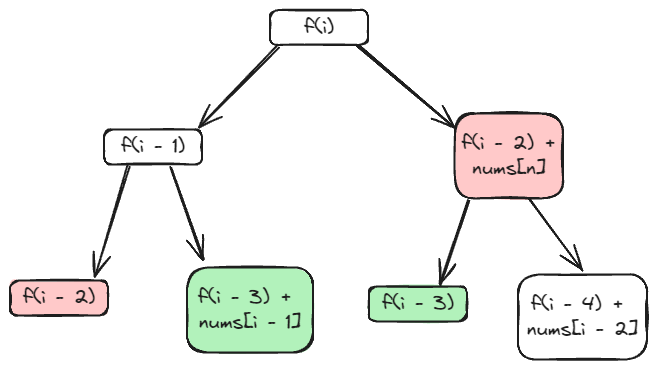

# [198. House Robber](https://leetcode.com/problems/house-robber/description/)

## Intuition
도둑은 한 집에서 두 가지 선택을 할 수 있다. 
- 현재 집을 털고, 두 칸 전 집에서 얻을 수 있는 최대 금액을 갖는다.
- 현재 집을 털지 않고, 한 칸 전 집에서 얻을 수 있는 최대 금액을 갖는다.

도둑의 현재 위치를 `i`라고 했을 때, 도둑의 선택을 아래 그림과 같이 표현할 수 있다.
\
이 그림에서 도둑은 중복된 선택을 하게 된다. 한 번 계산한 위치는 값을 보관해 시간을 줄일 수 있다. 

## Algorithm
- 재귀함수 `recur`를 정의한다.
  - `int idx` : 도둑의 위치
  - `int[] nums` : 각 집이 갖고 있는 금액
  - `int[] cache` : 한 번 계산한 위치의 값을 저장할 배열
  1. 도둑의 위치가 배열 밖이라면 `0`을 리턴하며 재귀함수를 종료한다.
  2. `cache[idx]`가 `-1`이 아니라면 계산했던 위치이다. 계산했던 값을 리턴하며 재귀 함수를 종료한다.
  3. `nums[idx] + recur(idx - 2), recur(idx - 1)` 중 최대 값을 현재 위치에 저장하고 리턴하며 재귀 함수를 종료한다.
- 배열 `cache`를 처음 방문한다는 뜻으로 `-1`로 채우고, 마지막 집 위치에서 재귀 함수를 호출해 결과를 리턴한다.

## Implementation
```java
class Solution {
    public int rob(int[] nums) {
        int n = nums.length;

        int[] cache = new int[n];
        Arrays.fill(cache, -1);

        return recur(n - 1, nums, cache);
    }

    private int recur(int idx, int[] nums, int[] cache) {
        if (idx < 0) {
            return 0;
        }
        if (cache[idx] != -1) {
            return cache[idx];
        }

        return cache[idx] = Math.max(nums[idx] + recur(idx - 2, nums, cache), recur(idx - 1, nums, cache));
    }
}
```

## Complexity
`n`은 `nums`의 길이.
- Time complexity: O(n)\
배열 `cache`를 작성하는 데 `n`만큼의 시간을 사용한다.

- Space complexity: O(n)\
배열 `cache`와 콜 스택에서 `n`만큼의 공간을 사용한다.
