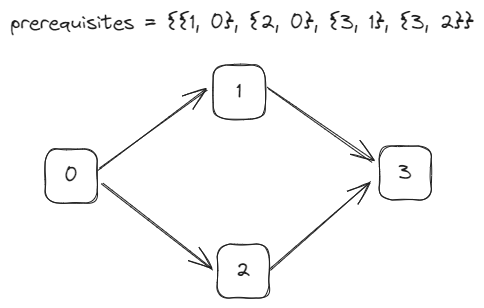

# [210. Course Schedule II](https://leetcode.com/problems/course-schedule-ii/description/)

## Intuition
위상 정렬을 이용해 문제를 해결할 수 있다.\
주어진 `prerequisites`로 방향이 있는 그래프를 만든다. 강의는 그래프의 정점이 되고, 전제 조건은 간선이 된다.\
\
진입 차수가 없는 정점부터 처리한다. 처리 중인 정점과 연결된 정점의 진입 차수를 감소시키고, 진입 차수가 0이라면 연결된 정점을 처리할 수 있다.
이를 반복해 모든 정점을 처리할 수 있다. 만약 사이클이 발생한다면 처리할 수 없으니 빈 배열을 리턴한다.

## Algorithm
1. 전제 조건 `prerequisites`를 이용해 그래프 `graph`와 배열 `numPrerequisites`를 만든다.
2. 큐 `queue`를 초기화하고 `numPrerequisites`가 `0`인 강의를 `queue`에 추가한다.
3. 강의 수강 순서를 저장할 배열 `order`와 저장 인덱스 `idx`를 초기화한다.
4. `queue`에 강의가 남아있다면 아래를 반복한다.
   1. `queue`에서 꺼낸 강의를 `course`에 저장한다.
   2. `order`에 현재 강의를 추가하고 `idx`를 증가시킨다.
   3. 현재 강의를 수강하고 들을 수 있는 다음 강의들의 `numPrerequisites`를 `1` 감소시킨다.
   4. `numPrerequisites`이 `0`인 다음 강의는 들을 수 있으니 `queue`에 추가한다.
5. 모든 코스를 완료했다면 `order`를 리턴하고, 그렇지 않다면 빈 배열을 리턴한다.

## Implementation
```java
class Solution {
   public int[] findOrder(int numCourses, int[][] prerequisites) {
      List<List<Integer>> graph = new ArrayList<>();
      int[] numPrerequisites = new int[numCourses];

      for (int i = 0; i < numCourses; i++) {
         graph.add(new ArrayList<>());
      }

      for (int[] prerequisite : prerequisites) {
         numPrerequisites[prerequisite[0]]++;
         graph.get(prerequisite[1]).add(prerequisite[0]);
      }

      Queue<Integer> queue = new LinkedList<>();

      for (int course = 0; course < numCourses; course++) {
         if (numPrerequisites[course] == 0) {
            queue.offer(course);
         }
      }

      int[] order = new int[numCourses];
      int idx = 0;

      while (!queue.isEmpty()) {
         int course = queue.poll();
         order[idx++] = course;

         for (int nextCourse : graph.get(course)) {
            numPrerequisites[nextCourse]--;

            if (numPrerequisites[nextCourse] == 0) {
               queue.offer(nextCourse);
            }
         }
      }

      return idx == numCourses ? order : new int[0];
   }
}
```

## Complexity
`n`은 `numCourses`, `m`은 `prerequisites`의 길이.
- Time complexity: O(n + m)
- Space complexity: O(n + m)
