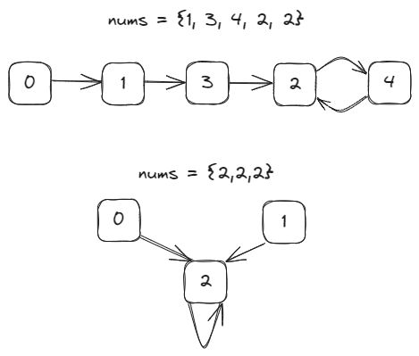

# [287. Find the Duplicate Number](https://leetcode.com/problems/find-the-duplicate-number/)

## Intuition
주어진 배열을 아래 그림과 같이 배열의 인덱스를 노드의 값으로 하고, 배열의 값을 노드 간의 연결로 보는 그래프로 생각해 볼 수 있다.\
\
그래프엔 사이클이 발생하고 사이클의 시작 노드는 중복된 숫자가 된다.
[플로이드의 토끼와 거북이 알고리즘](https://en.wikipedia.org/wiki/Cycle_detection#Floyd's_tortoise_and_hare)을 사용해 사이클이 시작하는 노드를 찾을 수 있다.


## Algorithm
1. `slow`, `fast`를 노드 `0`으로 초기화한다.
2. 두 포인터가 사이클 내에서 만날 때까지 `slow`는 한 칸, `fast`는 두 칸 이동한다.
3. `slow`를 `0`으로 변경한다.
4. 두 포인터가 같은 노드를 가리킬 때까지 한 칸씩 이동한다.
5. `slow`를 리턴한다

## Implementation
```java
class Solution {
    public int findDuplicate(int[] nums) {
        int slow = 0;
        int fast = 0;

        while (slow == 0 || slow != fast) {
            slow = nums[slow];
            fast = nums[nums[fast]];
        }

        slow = 0;

        while (slow != fast) {
            slow = nums[slow];
            fast = nums[fast];
        }

        return slow;
    }
}
```

## Complexity
`n`은 배열 `nums`의 길이.
- Time complexity: O(n)
- Space complexity: O(1)
