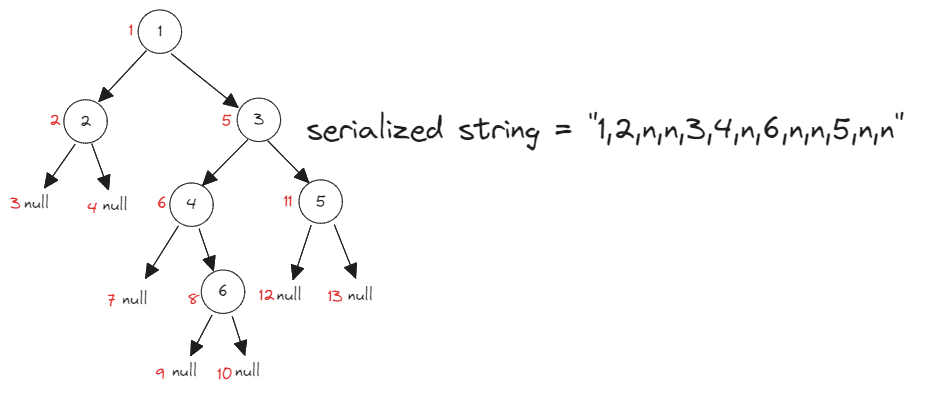

# [297. Serialize and Deserialize Binary Tree](https://leetcode.com/problems/serialize-and-deserialize-binary-tree/)

## Intuition
아래 그림은 트리를 `preorder` 방식으로 순회할 때 노드 방문 순서와 직렬화한 문자열이다. 직렬화한 문자열은 `preorder`로 순회한 노드 방문 순서대로 작성한다.
\
트리를 순회하면서 문자열을 생성하고, 노드가 `null`일 경우 문자열에 특정한 표시를 한다.
이 표시는 역직렬화 시 재귀 함수의 종료 조건으로 사용되어 트리를 원래 상태로 복구할 수 있게 한다. 

## Algorithm
- `serialize` 메소드
  1. 문자열을 저장할 `sb`를 초기화한다.
  2. `buildString` 메소드를 호출하여 완성한 문자열을 반환한다.
- `deserialize` 메소드
  1. `data`를 `","`로 구분하여 나눈 배열을 `strs`에 할당한다.
  2. `buildTree` 메소드를 호출하여 트리의 루트 노드를 반환한다.
- `buildString` 메소드
  1. `node`가 `null`일 경우, `sb`에 `"n,"`을 추가하고 함수를 종료한다.
  2. `sb`에 `node`의 값과 `","`을 추가한다.
  3. `buildString` 메소드를 재귀적으로 호출하여 `node`의 왼쪽 자식과 오른쪽 자식을 처리한다.
- `buildTree` 메소드
  1. `idx`가 `strs`의 길이와 같다면 `null`을 반환하며 함수를 종료한다.
  2. `value`에 `strs`의 `idx`번 째 값을 할당하고 `idx`를 증가시킨다.
  3. `value`가 `"n"`이라면 `null`을 반환하며 함수를 종료한다.
  4. `value`를 정수로 변환하여 트리 노드를 만든 후, `buildTree` 메소드를 재귀적으로 호출해 왼쪽 자식과 오른쪽 자식을 연결한 다음, 노드를 반환한다.

## Implementation
```java
public class Codec {
    public String serialize(TreeNode root) {
        StringBuilder sb = new StringBuilder();

        buildString(root, sb);

        return sb.deleteCharAt(sb.length() - 1).toString();
    }

    public TreeNode deserialize(String data) {
        String[] strs = data.split(",");

        return buildTree(strs, new int[] {0});
    }

    private void buildString(TreeNode node, StringBuilder sb) {
        if (node == null) {
            sb.append("n,");
            return;
        }

        sb.append(String.valueOf(node.val)).append(',');

        buildString(node.left, sb);
        buildString(node.right, sb);
    }

    private TreeNode buildTree(String[] strs, int[] idx) {
        if (idx[0] == strs.length) {
            return null;
        }

        String value = strs[idx[0]++];

        if (value.equals("n")) {
            return null;
        }

        return new TreeNode(Integer.parseInt(value), buildTree(strs, idx), buildTree(strs, idx));
    }
}

// Your Codec object will be instantiated and called as such:
// Codec ser = new Codec();
// Codec deser = new Codec();
// TreeNode ans = deser.deserialize(ser.serialize(root));
```

## Complexity
`n`은 트리 노드 개수
- Time complexity: O(n)
- Space complexity: O(n)
