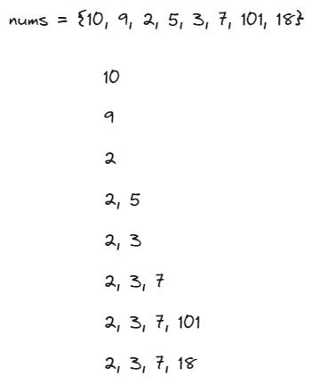

# [300. Longest Increasing Subsequence](https://leetcode.com/problems/longest-increasing-subsequence/)

## Intuition
배열을 순회하며 현재 위치한 배열의 값을 마지막으로 하는 서브시퀀스를 만들어 최대 길이의 서브시퀀스를 찾는다.\
오름차순 서브시퀀스이기 때문에 현재 값이 들어갈 위치를 이진 탐색으로 빠르게 결정할 수 있다. 진행 과정은 아래 그림과 같다.\


## Algorithm
1. 배열 `LIS`에 현재 최대 길이의 서브시퀀스를 저장한다.
2. 배열 `nums`를 순회하며 현재 인덱스의 값이 `LIS`의 마지막 값보다 크면 끝에 추가하고, 그렇지 않으면 이진 탐색을 통해 lower bound 인덱스를 찾아 현재 값으로 교체한다.
3. `LIS`의 길이를 리턴한다.

## Implementation
```java
class Solution {
    public int lengthOfLIS(int[] nums) {
        int n = nums.length;

        int[] LIS = new int[n];
        int idx = -1;

        for (int num : nums) {
            if (idx == -1 || num > LIS[idx]) {
                LIS[++idx] = num;
            } else {
                LIS[binarySearch(0, idx, num, LIS)] = num;
            }
        }

        return idx + 1;
    }

    private int binarySearch(int lo, int hi, int target, int[] arr) {
        while (lo <= hi) {
            int mid = (lo + hi) / 2;

            if (arr[mid] >= target) {
                hi = mid - 1;
            } else {
                lo = mid + 1;
            }
        }

        return lo;
    }   
}
```

## Complexity
`n`은 배열 `nums`의 길이.
- Time complexity: O(nlogn)
- Space complexity: O(n)
