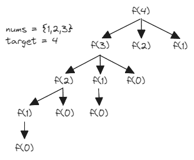

# [377. Combination Sum IV](https://leetcode.com/problems/combination-sum-iv/)

## Intuition
현재 `target`에서 가질 수 있는 조합의 수는 `target`에서 주어진 배열 `nums`의 요소를 뺀 이전 조합의 합이다.\
아래 그림은 이를 재귀적으로 나타낸 것이다.\
\
Dynamic Programming 기법으로 중복되는 문제들을 다시 사용해 시간 복잡도를 줄일 수 있다.

## Algorithm
1. `int[] cache`에 한 번 계산했던 문제들을 저장한다. 아직 계산하지 않았다는 뜻으로 `-1`로 초기화한다.
2. `target`으로 재귀함수를 호출한 결과를 반환한다.
   1. 기본 케이스인 `target`이 `0`이라면 `1`을 반환한다.
   2. 이미 계산했던 케이스라면 `cache[target]`을 반환한다.
   3. 배열 `nums`를 순회하며 `target - num`으로 재귀함수를 호출한 결과를 `result`에 추가한다.
   4. `cache[target]`에 `result`를 저장하고 반환한다.

## Implementation
```java
class Solution {
    public int combinationSum4(int[] nums, int target) {
        int[] cache = new int[target + 1];

        Arrays.fill(cache, -1);

        return countCombinations(target, nums, cache);
    }

    private int countCombinations(int target, int[] nums, int[] cache) {
        if (target == 0) {
            return 1;
        }

        if (cache[target] != -1) {
            return cache[target];
        }

        int result = 0;

        for (int num : nums) {
            if (target - num >= 0) {
                result += countCombinations(target - num, nums, cache);
            }
        }

        return cache[target] = result;
    }
}
```

## Complexity
`n`은 배열 `nums`의 길이
- Time complexity: O(n * target)
- Space complexity: O(target)
