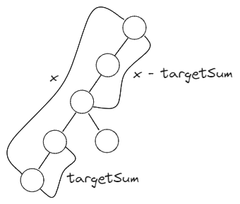

# [437. Path Sum III](https://leetcode.com/problems/path-sum-iii/description/)

## Intuition
DFS 기법으로 트리를 순회하며, 루트 노드에서 각 노드까지 Prefix Sum을 계산하여 합이 `targetSum`인 구간을 찾는다.\
\
위 그림과 같이 현재 노드까지 합이 `x`일 때, 현재 탐색한 경로에서 합이 `x - targetSum`인 노드를 찾으면 그 사이 구간은 합이 `targetSum`이 된다.
합의 개수를 저장해 이를 빠르게 계산할 수 있다.

## Algorithm
- `pathSum` 메소드 : 트리에서 경로의 합이 `targetSum`과 일치하는 경로의 수를 반환한다.
  1. `Map<Long, Integer> sumCountMap` : 루트 노드에서 리프 노드까지의 합이 개수를 저장한다.
  2. 초기 설정으로 합이 0인 서브어레이의 개수를 1개로 설정한다.
  3. `dfs` 메소드를 호출해 재귀적으로 경로의 수를 계산한다.
- `dfs` 메소드 : DFS 기법으로 트리를 탐색해, 경로의 합이 `targetSum`인 경로의 개수를 계산한다.
  1. 현재 노드가 `null`이라면 0을 반환하며 재귀 호출을 종료한다.
  2. `int result`에 경로의 개수를 저장한다.
  3. `sum`에 현재 노드의 값을 더하고 현재 노드를 마지막으로 하는 경로 중에서 경로의 합이 `targetSum`인 경로의 수를 `result`에 더한다.
  4. `sumCountMap`에 현재 `sum`의 개수를 1 증가시킨다.
  5. 자식 노드로 재귀 호출하여 계산한 경로의 수를 `result`에 더한다.
  6. 재귀 호출을 종료하기 전에 `sumCountMap`에 현재 `sum`의 개수를 1 감소시킨다.
  7. `result`를 반환하며 재귀 호출을 종료한다.

## Implementation
```java
/**
 * Definition for a binary tree node.
 * public class TreeNode {
 *     int val;
 *     TreeNode left;
 *     TreeNode right;
 *     TreeNode() {}
 *     TreeNode(int val) { this.val = val; }
 *     TreeNode(int val, TreeNode left, TreeNode right) {
 *         this.val = val;
 *         this.left = left;
 *         this.right = right;
 *     }
 * }
 */
class Solution {
    public int pathSum(TreeNode root, int targetSum) {
        Map<Long, Integer> sumCountMap = new HashMap<>();
        sumCountMap.put(0l, 1);

        return dfs(root, 0, targetSum, sumCountMap);
    }

    private int dfs(TreeNode root, long sum, long targetSum, Map<Long, Integer> sumCountMap) {
        if (root == null) {
            return 0;
        }

        int result = 0;

        sum += root.val;
        if (sumCountMap.containsKey(sum - targetSum)) {
            result += sumCountMap.get(sum - targetSum);
        }

        sumCountMap.put(sum, sumCountMap.getOrDefault(sum, 0) + 1);

        result += dfs(root.left, sum, targetSum, sumCountMap);
        result += dfs(root.right, sum, targetSum, sumCountMap);

        sumCountMap.put(sum, sumCountMap.get(sum) - 1);

        return result;
    }
}
```

## Complexity
`n`은 트리 노드의 개수
- Time complexity: O(n)

- Space complexity: O(n)
