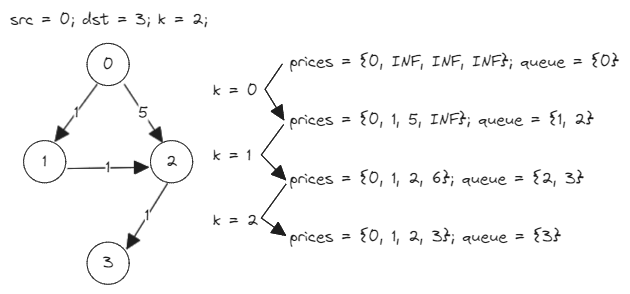

# [787. Cheapest Flights Within K Stops](https://leetcode.com/problems/cheapest-flights-within-k-stops/)

## Intuition
BFS 기법으로 사용해 최소 비용을 계산한다.\
아래 그림처럼 `k + 1`번 레벨 단위로 최소 비용을 갱신한다.\


## Algorithm
1. `List<List<int[]>> graph`에 `0`부터 `n - 1`의 노드를 갖고, `flights`를 간선으로 하는 그래프를 생성한다.
2. `int[] prices`는 `src`에서 각 노드까지의 최소 이동 비용을 저장하는 배열이다. 배열의 값을 최댓값으로 초기화한다.
3. `Queue<Integer> queue`를 초기화한다. 
4. `queue`에 `src`를 추가하고, `prices[src]`를 `0`으로 변경한다.
5. 아래 작업을 `k + 1`번 반복한다. `queue`가 비어있다면 종료한다.
   1. 현재 `queue`에 있는 노드만 꺼내기 위해 `size`에 `queue`의 사이즈를 저장한다.
   2. `prevPrices`에 현재 `prices`를 복사한다. 현재 `prices`를 계산하는데 이용한다.
   3. `queue`에서 `size`개의 노드를 꺼내 인접한 노드와 최소 비용을 계산한다. 최소 비용이 갱신된다면 `queue`에 인접한 노드를 추가한다. 
6. `prices[dst] == Integer.MAX_VALUE`라면 경로가 없으니 `-1`을 반환, 아니라면 `prices[dst]`를 반환한다.

## Implementation
```java
class Solution {
    public int findCheapestPrice(int n, int[][] flights, int src, int dst, int k) {
        List<List<int[]>> graph = makeGraph(n, flights);

        int[] prices = new int[n];
        Arrays.fill(prices, Integer.MAX_VALUE);

        Queue<Integer> queue = new ArrayDeque<>();

        queue.offer(src);
        prices[src] = 0;

        for (int i = 0; i <= k && !queue.isEmpty(); i++) {
            int size = queue.size();
            int[] prevPrices = prices.clone();

            while (size-- > 0) {
                int u = queue.poll();

                for (int[] edge : graph.get(u)) {
                    int v = edge[1];
                    int w = edge[2];

                    if (prevPrices[u] + w >= prices[v]) {
                        continue;
                    }

                    prices[v] = prevPrices[u] + w;
                    queue.offer(v);
                }
            }
        }

        return prices[dst] == Integer.MAX_VALUE ? -1 : prices[dst];
    }

    private List<List<int[]>> makeGraph(int n, int[][] edges) {
        List<List<int[]>> result = new ArrayList<>();

        for (int i = 0; i < n; i++) {
            result.add(new ArrayList<>());
        }

        for (int[] edge : edges) {
            result.get(edge[0]).add(edge);
        }

        return result;
    }
}
```

## Complexity
`m`은 `flights`의 길이
- Time complexity: O(k * (n + m))
- Space complexity: O(n + m)
