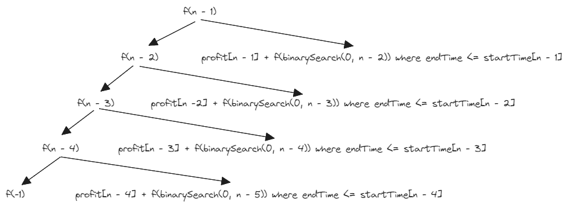

# [1235. Maximum Profit in Job Scheduling](https://leetcode.com/problems/maximum-profit-in-job-scheduling/)

## Intuition
`jobs` 배열을 생성하고 `endTime` 기준으로 오름차순 정렬한다. 임의의 인덱스 `i`에서 작업을 선택하는 경우의 수는 두 가지가 있다.
- 현재 작업을 선택하는 경우
  - 이 경우 얻을 수 있는 이익은 현재 작업의 이익 `profit[i]`와, 현재 작업이 시작하기 전 마지막 작업의 인덱스 `j`에서 얻을 수 있는 최대 이익의 합이다.
  - `j`는 `endTime <= startTime[i]`을 만족하는 마지막 인덱스다.
  - `j`를 빠르게 찾기 위해 Binary Search 기법을 사용한다. `jobs` 배열은 `endTime`을 기준으로 오름차순 정렬되어있다.
- 현재 작업을 선택하지 않는 경우
  - 이 경우 얻을 수 있는 이익은 `i - 1`에서 얻을 수 있는 최대 이익이다.

위 설명을 그림으로 표현하면 아래와 같다.\


작은 문제들이 반복되며, 큰 문제를 해결하기 위해 이전에 해결한 작은 문제들을 재사용하고 있다. Dynamic Programming 기법을 사용하여 문제를 효율적으로 해결할 수 있다.

## Implementation
```java
class Solution {
    public int jobScheduling(int[] startTime, int[] endTime, int[] profit) {
        int n = startTime.length;

        int[][] jobs = new int[n][];

        for (int i = 0; i < n; i++) {
            jobs[i] = new int[] {startTime[i], endTime[i], profit[i]};
        }

        Arrays.sort(jobs, (a, b) -> Integer.compare(a[1], b[1]));

        int[] cache = new int[n];

        return findMaximumProfit(n - 1, jobs, cache);
    }

    private int findMaximumProfit(int index, int[][] jobs, int[] cache) {
        if (index < 0) {
            return 0;
        }

        if (cache[index] > 0) {
            return cache[index];
        }

        int maximumProfit = Math.max(
            jobs[index][2] + findMaximumProfit(binarySearch(0, index - 1, jobs[index][0], jobs), jobs, cache),
            findMaximumProfit(index - 1, jobs, cache)
        );

        return cache[index] = maximumProfit;
    }

    private int binarySearch(int lo, int hi, int target, int[][] array) {
        while (lo <= hi) {
            int mid = (lo + hi) / 2;

            if (array[mid][1] > target) {
                hi = mid - 1;
            } else {
                lo = mid + 1;
            }
        }
        
        return hi;
    }
}
```

## Complexity
`n`은 입력된 배열의 길이
- Time complexity: O(nlogn)
- Space complexity: O(n)
